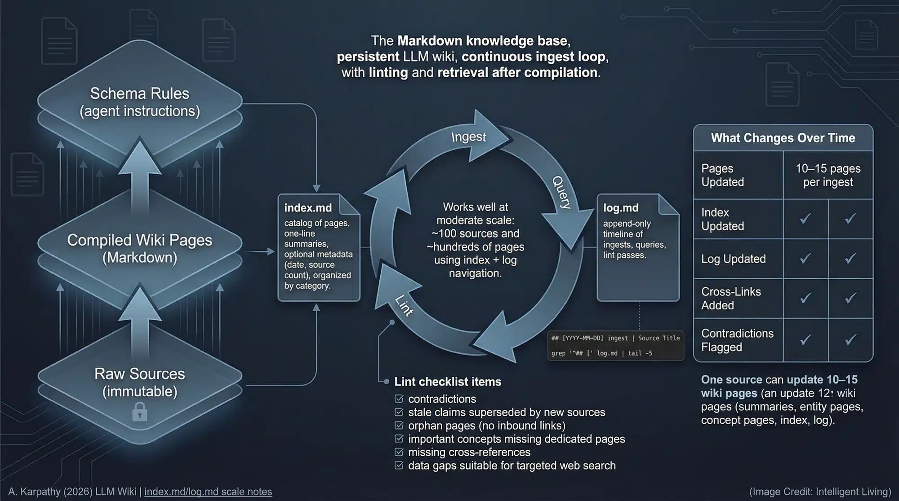

# GitHub Copilot Wiki: An AI-Powered Second Brain Template

**A forkable template for building LLM-maintained personal knowledge bases using GitHub Copilot.**

[](LICENSE)
[](https://github.com/SriSatyaLokesh/copilot-llm-wiki/stargazers)
[](https://github.com/SriSatyaLokesh/copilot-llm-wiki/network/members)
[](https://github.com/SriSatyaLokesh/copilot-llm-wiki/generate)
[](https://github.com/features/copilot)
[](https://obsidian.md/)
[](CONTRIBUTING.md)

Instead of starting from scratch on every query, Copilot incrementally builds and maintains a persistent, interlinked wiki of markdown files that compounds with every source ingested.

This project is an implementation of the **LLM-Wiki** concept popularized by [Andrej Karpathy](https://gist.github.com/karpathy/442a6bf555914893e9891c11519de94f), designed to create a "Compounding Knowledge Pattern" through purely file-based local storage.

> [!NOTE]
> **What is a Copilot LLM Wiki?**
> A **Copilot LLM Wiki** is a local, version-controlled second brain where GitHub Copilot acts as an autonomous librarian. Rather than relying on transient chat windows or complex vector databases, it uses standard Markdown files to continuously extract concepts, cross-reference entities, maintain an alphabetical master index, and log knowledge growth across your favorite IDEs and markdown editors.

---

## 📑 Table of Contents
- [🏗️ Architecture: The Three Layers](#️-architecture-the-three-layers)
- [🚀 10-Minute Setup Guide](#-10-minute-setup-guide)
  - [💻 Terminal Quick Start (One-liners)](#-terminal-quick-start-one-liners)
- [⚙️ Configuration](#️-configuration)
- [🧠 Core Workflows](#-core-workflows)
  - [📥 Ingest](#-ingest)
  - [🔍 Query](#-query)
  - [🧹 Lint](#-lint)
- [🛠️ Customization](#️-customization)
- [🤖 Librarian Agent (CLI)](#-librarian-agent-cli)
- [📊 Visualization (Obsidian Recommended)](#-visualization-obsidian-recommended)
- [🔌 Adapters & Interoperability (OKF v0.2)](#-adapters--interoperability-okf-v02)
- [❓ Frequently Asked Questions (FAQ)](#-frequently-asked-questions-faq)
- [🤝 Contributing & Community](#-contributing--community)
- [📜 Citation & License](#-citation--license)

---

## 🏗️ Architecture: The Three Layers
The system is divided into three distinct layers of responsibility:



1.  **Raw Sources (`raw/`)**: Your collection of source documents. These are **immutable**—the AI reads them but never modifies them.
2.  **The Wiki (`wiki/`)**: Generating interlinked markdown files. The AI **owns** this layer—it writes it; you read it.
3.  **The Schema (`.github/copilot-instructions.md`)**: The "brain" or configuration layer. It tells the AI how to be a disciplined wiki maintainer rather than a generic chatbot.

---

## 🚀 10-Minute Setup Guide

1.  **Fork this repository**: Click the [**Use this template**](https://github.com/SriSatyaLokesh/copilot-llm-wiki/generate) button or "Fork" to create your own copy.
2.  **Clone and Open in VS Code**: Open the repo in an environment with GitHub Copilot installed.

### 💻 Terminal Quick Start (One-liners)
For rapid setup, you can skip the UI and use the terminal:

-   **Scaffold only** (fastest):
    ```bash
    npx degit SriSatyaLokesh/copilot-llm-wiki#main my-wiki
    ```
-   **Fork and Clone** (official):
    ```bash
    gh repo create my-wiki --template="SriSatyaLokesh/copilot-llm-wiki" --public --clone
    ```

---

## ⚙️ Configuration
1.  **Enable Prompt Files**:
    - Open VS Code Settings (`Ctrl+,` or `Cmd+,`).
    - Search for `github.copilot.chat.promptFiles`.
    - Set it to `true`.
2.  **Drop your first source**: Put a markdown file or a URL reference in the `raw/` directory.
3.  **Run Ingest**:
    - **In VS Code Chat**: Type `/ingest raw/<filename>.md` (or attach `.github/prompts/ingest.prompt.md`).
    - **Batch Automation**: Drop multiple markdown files in `raw/` and run the intake script:
      - **Bash**: `./.github/skills/wiki-ingest/scripts/intake.sh`
      - **PowerShell**: `.\.github\skills\wiki-ingest\scripts\intake.ps1`

---

## 🧠 Core Workflows

### 📥 Ingest
Tell Copilot to "ingest <source>". It will:
- Fetch and save the source to `raw/`.
- Extract key facts.
- Create/update pages in `wiki/entities/` and `wiki/concepts/`.
- Update the `wiki/index.md` and `wiki/log.md`.

### 🔍 Query
Ask a question about your knowledge domain. Copilot will:
- Read `wiki/index.md` to find relevant pages.
- Consult the interlinked wiki pages.
- Answer with citations.
- Offer to file the answer as a new QA page in `wiki/qa/`.

### 🧹 Lint
Run "lint the wiki" via `lint.prompt.md` or the `librarian` agent to check for orphans, broken links, or contradictions.

---

## 🛠️ Customization

1.  Open `.github/copilot-instructions.md`.
2.  Find the `[YOUR DOMAIN]` placeholders and replace them with your specific domain (e.g., "Medical Research", "Codebase Documentation", "Legal Case Files").
3.  Customize the `wiki/overview.md` to reflect your project's goals.
4.  Refer to [TEMPLATE.md](TEMPLATE.md) for full customization patterns and guidelines.

---

## 🤖 Librarian Agent (CLI)

If you have the GitHub Copilot CLI installed, you can invoke the dedicated librarian agent:

```bash
copilot --agent librarian -p "ingest raw/new-data.md"
```

The librarian agent automatically decides between direct ingestion and using the intake scripts based on the complexity of your request.

---

## 📊 Visualization (Obsidian Recommended)
To get the most out of your LLM Wiki, we highly recommend using **[Obsidian](https://obsidian.md/)** to view your `wiki/` directory.

- **Knowledge Graph**: Use Obsidian's "Graph View" to see how your entities and concepts are interconnected.
- **Easy Navigation**: Clickable links, back-links, and local previews make exploring your knowledge base feel like a "second brain."
- **Markdown-Native**: Since the wiki is 100% standard markdown, Obsidian handles it natively without any conversion needed.

---

## 🔌 Adapters & Interoperability (OKF v0.2)

For enterprise AI systems, Google Cloud agents, or external multi-agent orchestrators that require standardized machine-readable bundles, this repository includes an official **Open Knowledge Format (OKF v0.2)** adapter in [`adapters/okf/`](adapters/okf/):

- **Clean Core Architecture**: The base wiki remains pure, distraction-free Markdown for rapid desktop note-taking and clean Obsidian viewing.
- **Export to OKF v0.2**: Run `python adapters/okf/export.py` to compile your wiki into a fully compliant OKF v0.2 bundle in `dist/okf/` (complete with YAML frontmatter, actor conventions, ISO timestamps, and progressive disclosure sub-indexes).
- **Native OKF Prompt**: For agents that prefer authoring notes with OKF frontmatter during chat, see [`adapters/okf/copilot-instructions.okf.md`](adapters/okf/copilot-instructions.okf.md).

*Original OKF v0.2 implementation contributed by [@aayush-t-gilead](https://github.com/aayush-t-gilead).*

---

## ❓ Frequently Asked Questions (FAQ)

### What is a Copilot LLM Wiki and how does it work?
A Copilot LLM Wiki is a persistent personal knowledge base that pairs GitHub Copilot's reasoning with local markdown storage. Instead of losing context between chat conversations, Copilot follows a strict schema (`copilot-instructions.md`) to read raw documents, synthesize concepts, cross-link entities, maintain an alphabetical index, and preserve an audit log.

### How does this differ from traditional RAG (Retrieval-Augmented Generation)?
Traditional RAG slices documents into arbitrary text chunks and stores them in opaque vector databases, often losing document hierarchy and relationship context. An LLM Wiki turns documents into human-readable, interlinked markdown pages where concepts connect semantically. You can inspect, edit, version-control, and browse every node in your knowledge graph.

### Can I use this with Obsidian, Logseq, or other markdown apps?
Yes. The entire wiki layer consists of standard relative markdown links (`[Page Name](wiki/entities/slug.md)`). Opening the root folder as an Obsidian vault gives you instant access to graph visualization, backlinks, canvas views, and full-text search.

### Which IDEs and GitHub Copilot models are supported?
The template works wherever GitHub Copilot Chat and Prompt Files are supported, including **VS Code**, **Visual Studio**, **JetBrains IDEs**, and the **GitHub Copilot CLI**. You can use any underlying model supported by Copilot (GPT-4o, Claude 3.5 Sonnet, Claude 3.7 Sonnet, Gemini 1.5 Pro).

### How does the system prevent contradictions and hallucinations?
The core schema mandates an **Index-First** and **Contradiction-Check** rule. Before the AI writes any new page, it reads `wiki/index.md` and related entity files. If a new source contradicts an existing claim, the Librarian flags the discrepancy for resolution rather than overwriting silently.

### Does this support Open Knowledge Format (OKF v0.2)?
Yes. While the default wiki remains clean Markdown for human readability, you can export your entire knowledge base into an OKF v0.2 conformant bundle anytime using `python adapters/okf/export.py`.

### Is my personal knowledge base private?
Yes. All files are stored locally in your workspace. You retain complete ownership and control. You can keep your repository private on GitHub or host it publicly as an open-source resource.

---

## 🤝 Contributing & Community

Contributions are welcome! Please check out [CONTRIBUTING.md](CONTRIBUTING.md) for details on submitting prompt improvements, script updates, or documentation fixes. All participants are expected to adhere to the [Code of Conduct](CODE_OF_CONDUCT.md).

- Found a bug? Open a [Bug Report](https://github.com/SriSatyaLokesh/copilot-llm-wiki/issues/new?template=bug_report.yml).
- Have a feature idea? Submit a [Feature Request](https://github.com/SriSatyaLokesh/copilot-llm-wiki/issues/new?template=feature_request.yml).
- Want to discuss workflows? Join [GitHub Discussions](https://github.com/SriSatyaLokesh/copilot-llm-wiki/discussions).

---

## 📜 Citation & License

If you use this template or reference this work in research or articles, please cite it using [CITATION.cff](CITATION.cff) or:

```bibtex
@software{copilot_llm_wiki_2026,
  author = {Sri Satya Lokesh},
  title = {GitHub Copilot Wiki: An AI-Powered Second Brain Template},
  url = {https://github.com/SriSatyaLokesh/copilot-llm-wiki},
  year = {2026}
}
```

This project is licensed under the [MIT License](LICENSE).

---
*Inspired by Andrej Karpathy's [llm-wiki](https://gist.github.com/karpathy/442a6bf555914893e9891c11519de94f). Built by the community.*

<!-- Schema.org Structured Data for SEO & Generative Discovery -->
<script type="application/ld+json">
{
  "@context": "https://schema.org",
  "@graph": [
    {
      "@type": "SoftwareSourceCode",
      "name": "GitHub Copilot Wiki: An AI-Powered Second Brain Template",
      "alternateName": "Copilot LLM Wiki",
      "description": "A forkable template for building LLM-maintained personal knowledge bases using GitHub Copilot, implementing Andrej Karpathy's Compounding Knowledge Pattern.",
      "codeRepository": "https://github.com/SriSatyaLokesh/copilot-llm-wiki",
      "programmingLanguage": "Markdown",
      "author": {
        "@type": "Person",
        "name": "Sri Satya Lokesh"
      },
      "license": "https://opensource.org/licenses/MIT",
      "keywords": [
        "copilot llm wiki",
        "github copilot wiki",
        "llm wiki",
        "second brain template",
        "andrej karpathy",
        "obsidian",
        "generative ai"
      ]
    },
    {
      "@type": "FAQPage",
      "mainEntity": [
        {
          "@type": "Question",
          "name": "What is a Copilot LLM Wiki and how does it work?",
          "acceptedAnswer": {
            "@type": "Answer",
            "text": "A Copilot LLM Wiki is a persistent personal knowledge base that pairs GitHub Copilot's reasoning with local markdown storage. Rather than losing context between chats, Copilot reads raw documents, synthesizes concepts, cross-links entities, maintains an index, and preserves an audit log."
          }
        },
        {
          "@type": "Question",
          "name": "How does this differ from traditional RAG?",
          "acceptedAnswer": {
            "@type": "Answer",
            "text": "Traditional RAG slices documents into arbitrary text chunks in vector databases. An LLM Wiki converts documents into human-readable, interlinked markdown pages that connect semantically and are fully inspectable, editable, and version-controlled."
          }
        },
        {
          "@type": "Question",
          "name": "Can I use this with Obsidian?",
          "acceptedAnswer": {
            "@type": "Answer",
            "text": "Yes. The wiki layer consists of standard relative markdown links, making it 100% natively compatible with Obsidian's Graph View, backlinks, and search."
          }
        },
        {
          "@type": "Question",
          "name": "Which IDEs and GitHub Copilot models are supported?",
          "acceptedAnswer": {
            "@type": "Answer",
            "text": "The template supports VS Code, Visual Studio, JetBrains IDEs, and GitHub Copilot CLI, with underlying models including GPT-4o, Claude Sonnet, and Gemini Pro."
          }
        },
        {
          "@type": "Question",
          "name": "How does the system prevent contradictions and hallucinations?",
          "acceptedAnswer": {
            "@type": "Answer",
            "text": "The core schema mandates an Index-First and Contradiction-Check rule where Copilot reads the index and existing pages before writing, flagging discrepancies rather than silently overwriting."
          }
        }
      ]
    }
  ]
}
</script>
